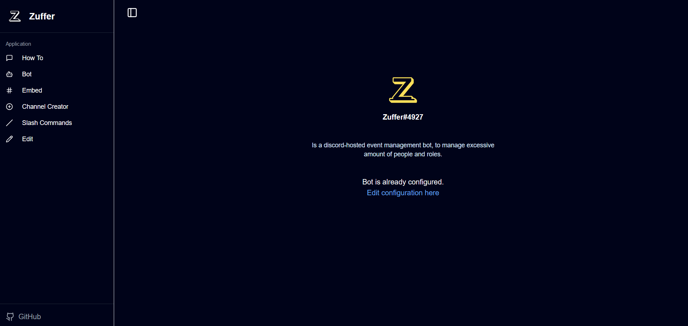

# Zuffer - Custom Discord Bot Builder

This is a [Next.js](https://nextjs.org) project bootstrapped with [`create-next-app`](https://nextjs.org/docs/app/api-reference/cli/create-next-app).

## Description

Zuffer is a custom Discord bot builder that allows you to create a personalized event management bot. With Zuffer, you can send custom template-based welcome messages, create channels, send embeds, and manage slash commands effortlessly.
## Console Preview

## Installation Prerequisites

Before you begin, ensure you have the following installed:

- [Node.js](https://nodejs.org/) (version 14.x or later)
- [npm](https://www.npmjs.com/) (version 6.x or later)
- [Git](https://git-scm.com/)

## Getting Started

First, clone the repository:

```bash
git clone https://www.github.com/muzaffarmhd/zuffer/
```

Navigate to the project directory:

```bash
cd embed/
```

Install the dependencies:

```bash
npm install
```

Run the development server:

```bash
npm run dev
```

Open [http://localhost:3000](http://localhost:3000) with your browser to see the result.


## Features

- **Welcomer**: Send custom template-based welcome messages to new members.
- **Embed Sender**: Create and send rich embeds to your Discord channels.
- **Channel Creator**: Easily create new channels within your Discord server.
- **Slash Commands**: Manage and execute custom slash commands.

## Usage Examples

### Sending a Welcome Message

To send a welcome message, configure the `Welcomer` component in your bot settings. Customize the message template to suit your needs.

### Creating a Channel

Use the `Channel Creator` feature to create new channels. Specify the channel name and type, and the bot will handle the rest.

### Sending an Embed

Utilize the `Embed Sender` to create rich embeds. Customize the embed content, color, and other properties before sending it to a channel.

### Managing Slash Commands

Configure and manage slash commands through the `Slash Commands` feature. Define custom commands and their respective actions.


## Contribution Guidelines

Zuffer is licensed under the GPL-3.0 License. If you use this code, you must make your code public as well. We welcome all contributions to improve Zuffer. To contribute, please follow these steps:

1. Fork the repository.
2. Create a new branch (`git checkout -b feature-branch`).
3. Make your changes and commit them (`git commit -m 'Add new feature'`).
4. Push to the branch (`git push origin feature-branch`).
5. Open a pull request.

Thank you for your contributions!